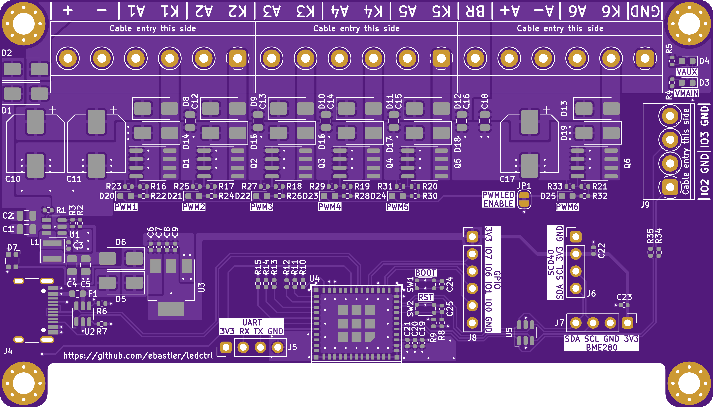
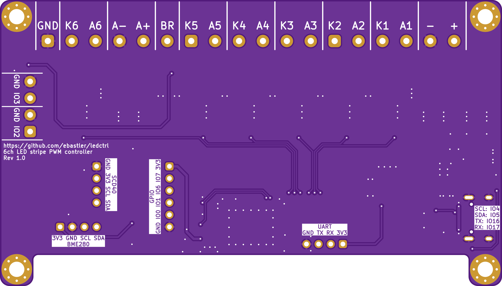
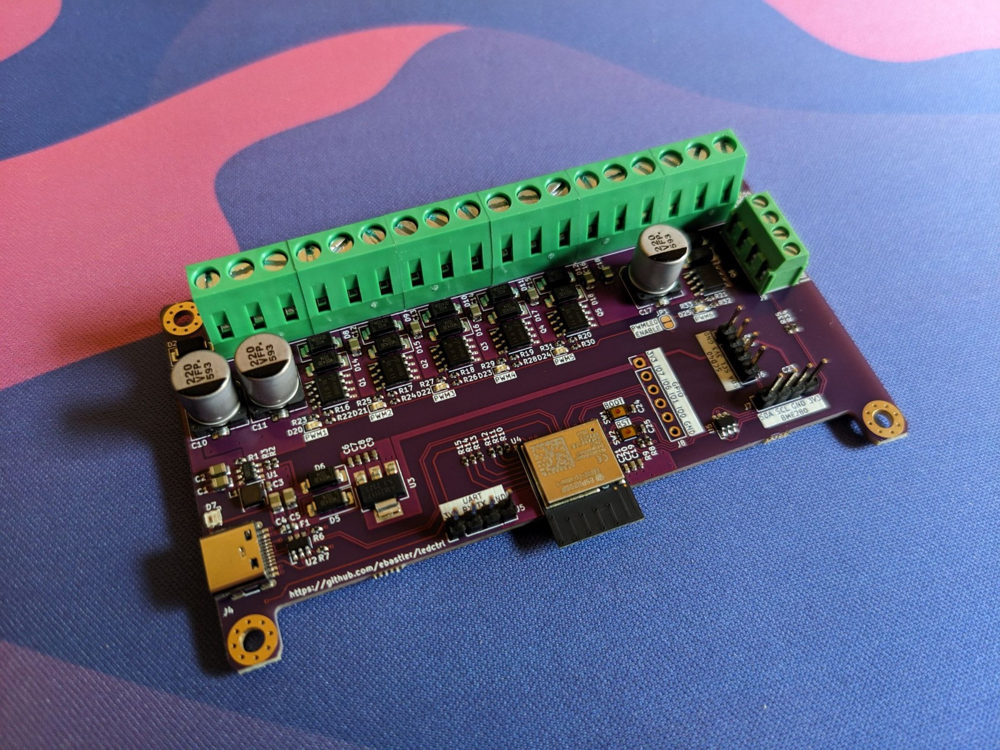
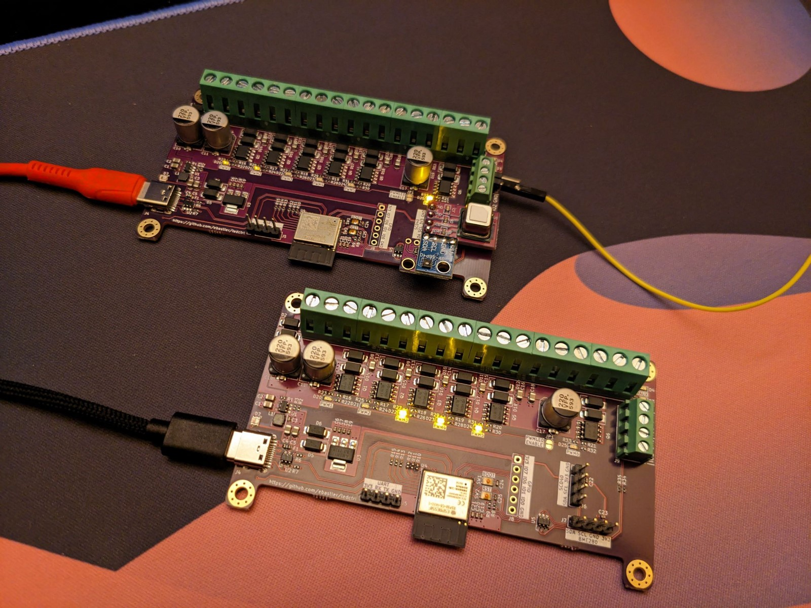
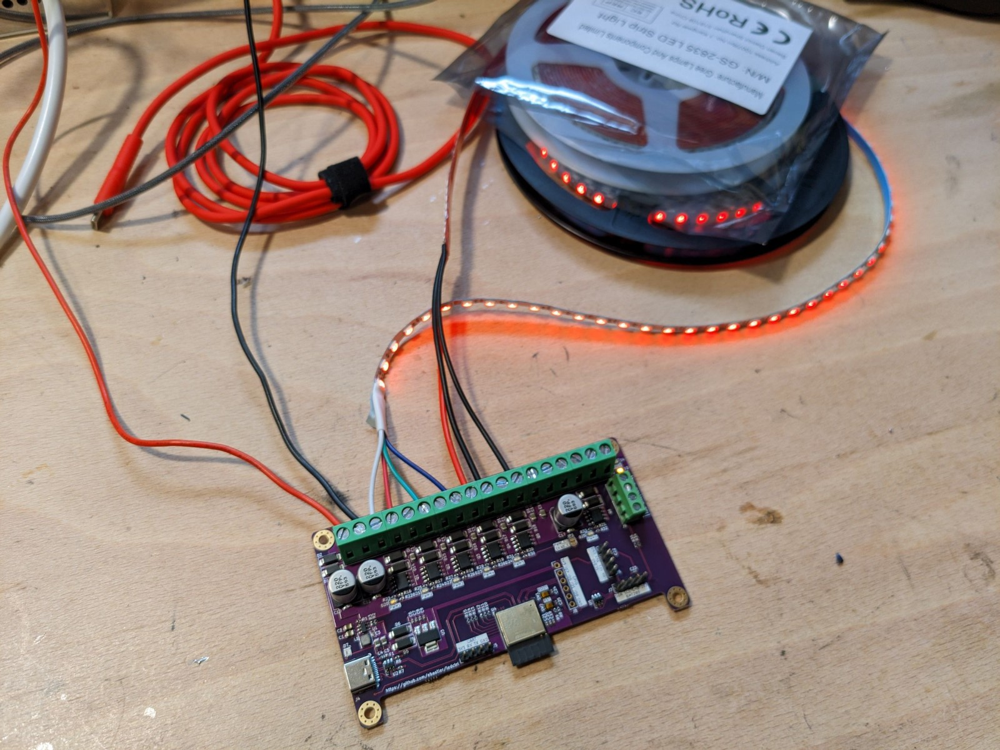

# ledctrl
This project was born with the idea of creating a simple and efficient way of controlling an RGB, one WW/CW and an additional aux stripe from a single smart-home capable controller. Then feature creep happened, and here we are.

The PCB uses a modern and power-efficient RISC-V based ESP32C6 and features a step-down converter to supply the 5V logic, as well as an LDO for the 3.3V logic. The Aux channel has a separate supply input from the other 5 channels, and both supply domains can be used for 12V or 24V stripes, not necessarily the same voltage at the same time. The logic supply is generated from either of the two supply channels, which are ORed together with diodes.

2 inputs for external buttons can be used to directly control the LEDs, or send commands via MQTT. I also added headers for the most common breakout boards for a bunch of different environmental sensors. 

While programming over USB works without issues for ESP32C6, I also added a UART header as a fallback, for debugging or just for use as another GPIO breakout.

### Features:
* Up to 5+1 channels of 12V or 24V LED stripes
* ESP32C6
* USB-C for programming
* Dim onboard LEDs to indicate status of each PWM channel, as well as both input power domains
* WS2812B LED onboard as a status indicator/for devboard use
* Almost all unused GPIOs are available on headers
* Headers for BME280, SCD40 and SGP40 environment sensors
* 2 inputs for pushbuttons/switches

### Software
The board is mainly made for use with [Tasmota](https://github.com/arendst/tasmota), and currently only supported using the `tasmota32c6cdc` firmware, taken off the `13.3.0.1` development branch. Stable versions have not yet added support for this chip. A template that can make use of most features will be published at a later point, once I finalized my firmware setup.

### Pictures

## Thanks
* arendst and the whole community of Tasmota contributors for their excellent firmware
* [MarvFPV](https://github.com/marvfpv) who surprisingly did not get upset about me sending updates of new revisions with minimal changes every other day asking for his opinion